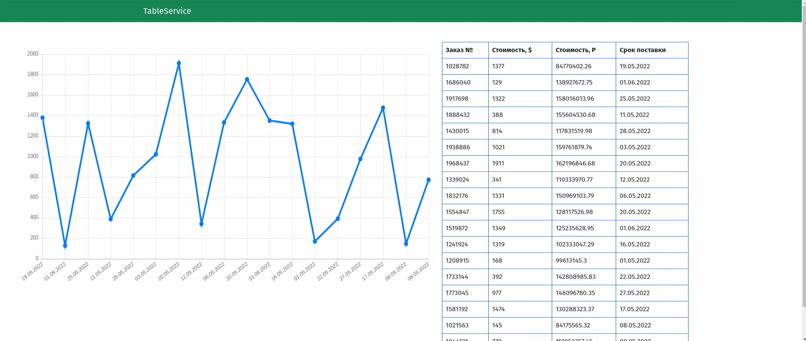

# TableService

## TableService - это web-приложение на Flask.

Данное приложение получает данные из документа при помощи Google API, сделанного в Google Sheets. 
Учитывается удаление и добавление строк в Google Sheets.
Используется база данных PostgreSql. Данные для перевода $ в рубли получаются по курсу ЦБ РФ.
Скрипт используещийся для получения данных работает автоматически используея планировщие задач Celery.

# Сборка репозитория и локальный запуск

## Запуск приложения на ОС Linux:
Выполните в консоли:

git clone https://github.com/Straigan/kitchen_recipes_flask.git  
docker-compose up  
docker exec -it web_kanal_service python3 create_db.py  

# Настройка

Для работы с Google Sheets, через Google API. Не обходимо создать в папке webapp credentials.json с помощью Apis & Services.

